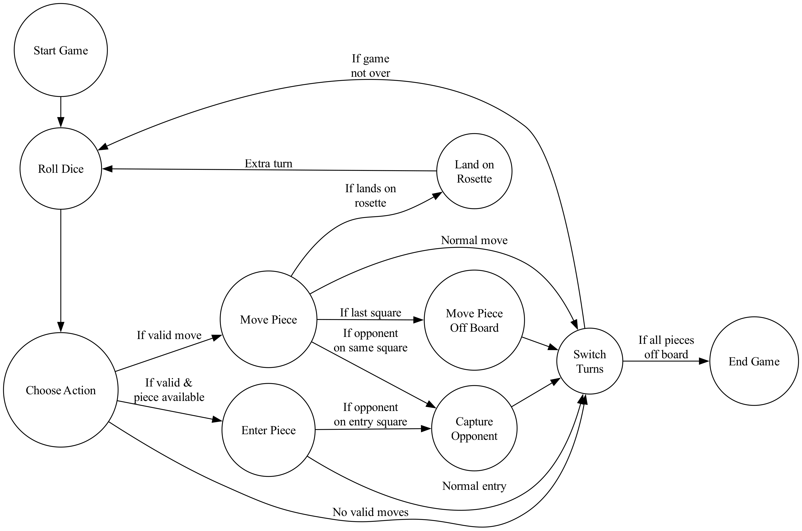

# The Royal Game of Ur

## Introduction

The Royal Game of Ur, also known as the Game of Twenty Squares, is one of the oldest known board games. Discovered in the Royal Tombs of Ur in Iraq, this game dates back to around 2600 BCE.

## Game Overview

The Royal Game of Ur is a race game played between two players. Each player has seven pieces that they need to move from their starting position, across the board, and off the other side. The first player to move all seven pieces off the board wins.

### The Board

The game board consists of 20 squares arranged in three rows:
- Two outer rows of 4 squares each, specific to each player
- A middle row of 8 squares, shared by both players

Some squares are marked with rosettes, which grant special privileges to the player landing on them.

### Basic Rules

1. Players roll four tetrahedral dice to determine their move.
2. Players can choose to either bring a new piece onto the board or move an existing piece.
3. If a player lands on an opponent's piece, that piece is captured and must start over.
4. Landing on a rosette square grants an extra turn.
5. Pieces must leave the board on an exact roll.

## Our Implementation

Our implementation of the Royal Game of Ur uses modern web technologies to bring this ancient game to life. We've used ClojureScript for the frontend, AWS Lambda for the backend game logic, and AWS Amplify for hosting and real-time synchronization.

### State Machine Design

The game logic is implemented as a state machine, which helps manage the complex flow of the game. The state diagram below illustrates the different states and transitions in the game:

Key states in our implementation include:
- Start Game
- Roll Dice
- Choose Action
- Enter Piece
- Move Piece
- Capture Opponent
- Land on Rosette
- Move Piece Off Board
- Switch Turns
- End Game

This state machine design allows for clear separation of concerns and makes it easier to manage the game's flow and rules.

### Patterns Used

Our implementation leverages several software design patterns and ClojureScript-specific patterns:

1. **State Machine Pattern**: As mentioned, the core game logic is implemented as a state machine, allowing for clear state transitions and rule enforcement.

2. **Immutable Data Structures**: Leveraging ClojureScript's immutable data structures for representing the game state, ensuring consistency and making it easier to reason about state changes.

3. **Event-Driven Architecture**: Using events to drive state changes, which couples well with the reactive nature of web applications.

4. **Functional Programming**: Utilizing ClojureScript's functional programming paradigm for pure functions and side-effect management.

5. **React Component Model**: Using the Pitch UIx library (a ClojureScript wrapper for React) for building the user interface as a composition of components.

6. **Unidirectional Data Flow**: Employing com.fbeyer/refx for state management, ensuring a unidirectional data flow.

7. **Serverless Architecture**: Utilizing AWS Lambda for backend game logic, allowing for scalable server-side operations.

8. **Real-time Synchronization**: Using AWS AppSync and DynamoDB for real-time game state synchronization between players.

## Technical Stack

- Frontend: ClojureScript, Pitch UIx (React wrapper), com.fbeyer/refx (state management)
- Backend: AWS Lambda (ClojureScript)
- Database: AWS DynamoDB
- Real-time Sync: AWS AppSync
- Hosting and Authentication: AWS Amplify
- Styling: Material-UI
